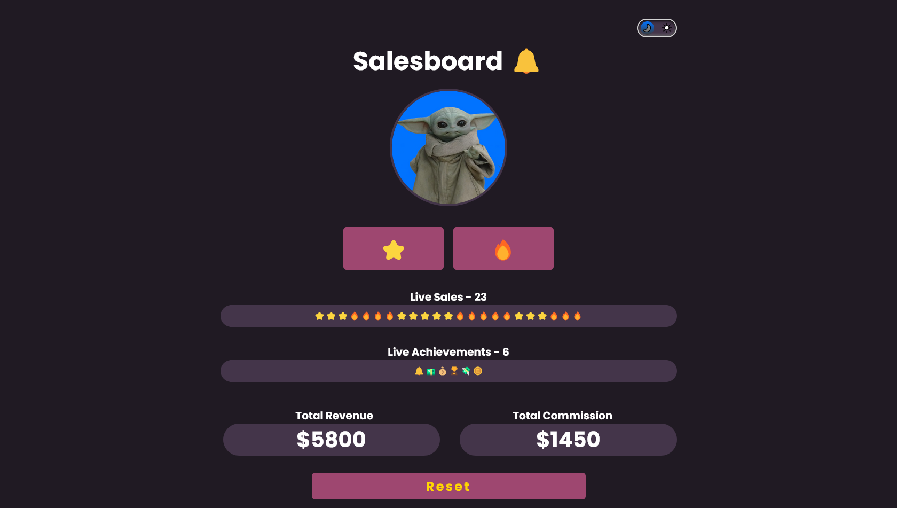
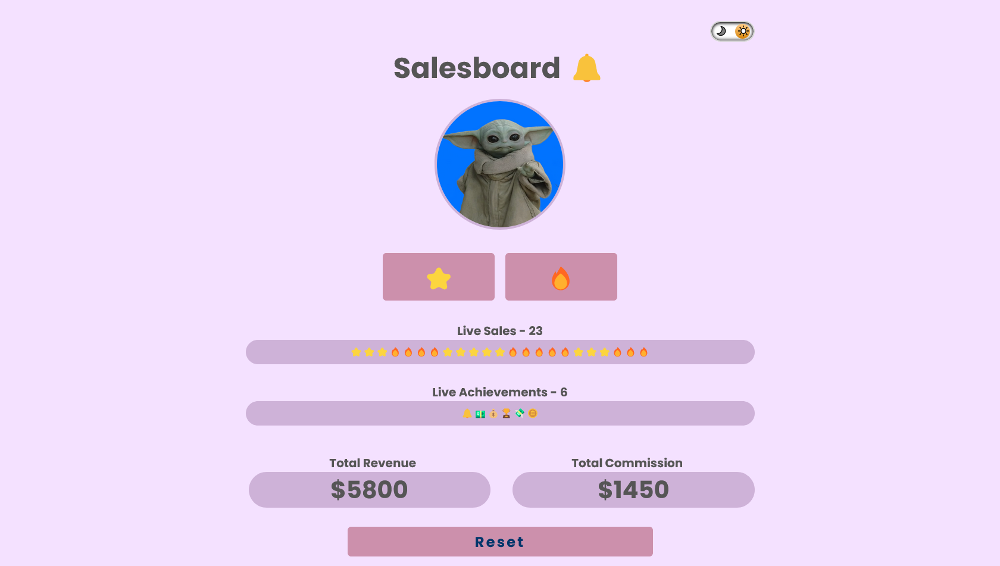
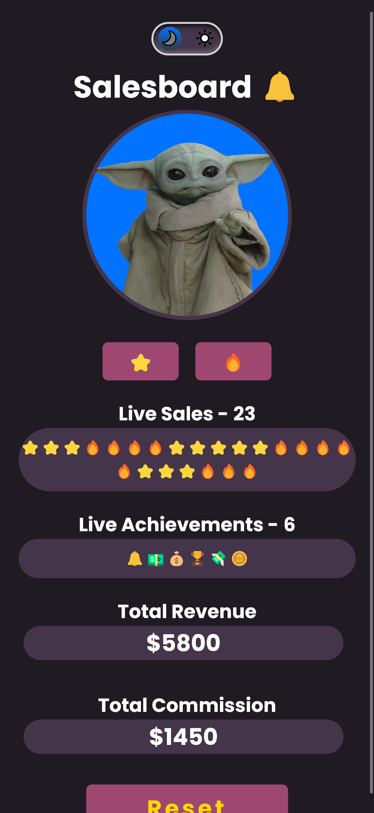
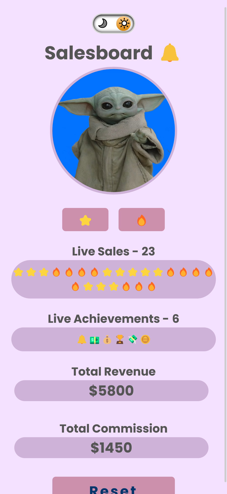

 ## Table of contents

- [Overview](#overview)
  - [The challenge](#the-challenge)
  - [Screenshot](#screenshot)
  - [Links](#links)
- [My process](#my-process)
  - [Built with](#built-with)
  - [What I learned](#what-i-learned)
  - [Continued development](#continued-development)
  - [Useful resources](#useful-resources)
- [Author](#author)
- [Acknowledgments](#acknowledgments)


### Overview

Scrimba M3 group project: Salesboard
- [Scrim](https://scrimba.com/scrim/co7fe43cfb10cd6f888c51d06)

### The challenge

Functionality:
- Two buttons for each product
    - star emoji
    - fire emoji
- Live Sales - counter increment
- Live achievements - counter increment
- Achievements emojis:
    - bell emoji: fist sale
    - bag of money: $2500 or more in revenue
    - trophy: 15th sale
- Total Revenue $ amount updates
- Total commission $ amount updates

Requirements:
- build it from "scratch"
- some files and info in the Scrim
- follow the Figma design
- make sure you use
    - functions
    - arrays
    - loops
    - objects

Stretch goals:
- add more achievements
- toggle switch for dark/light mode
- store data in browser - localStorage
- reset data button

[Figma design](https://www.figma.com/file/yOG2E3GasPrmnwl2EnLpSz/Salesboard-(Copy)?node-id=0-1&t=206o3y91cSroyB7P-0)

### Screenshot

<h2>Desktop - dark mode</h2>



<h2>Desktop - light mode</h2>



<h2>Mobile - dark mode</h2>



<h2>Mobile - light mode</h2>



### Links

- [Scrim](#)
- [Github](https://github.com/casserole27/scrimba-salesboard-app)
- [Live Site](https://www.clewisdev.com/scrimba-salesboard-app/)

## My process

- Create Github repository
- Set up basic HTML file 
- Set up basic CSS file
- Set up basic JavaScript file
- Consult Figma design files
- Project work
- Publish live URL
- Check markup and accessibility
(https://validator.w3.org/)
(https://wave.webaim.org/)
- README file

### Built with

- semantic HTML5
- CSS custom properties
- Responsive Web Design
- vanilla JavaScript
  - modules
  - local storage

### What I learned

- creating a toggle from scratch requires a lot of code!
- attempted keyboard focus for light/dark toggle 

```html
        <!--? added keyboard focus, but this is not an interactive element?-->
            <label 
                for="lightmode-toggle" 
                aria-label="light and dark mode toggle"
                tabindex="0"
                id="lightmode-label">
```

```javascript
//add toggle to keyboard focus
document.getElementById('lightmode-label').addEventListener('keypress', e => {
    if(e.key === "Enter") {
        renderLightMode()
    };
});
```

### Continued development

- [Dark mode with media query / system preferences](https://www.youtube.com/watch?v=_yCgeXFAXTM)


### Useful resources

- [Scrimba help](https://different-marmoset-f7b.notion.site/Salesboard-3bb783fcb97548f281a45c8001f08a36)

- [Build Light/Dark Mode Toggle using checkbox](https://www.youtube.com/watch?v=S-T9XoCMwt4)

- [Light/Dark Mode JavaScript](https://www.youtube.com/watch?v=wodWDIdV9BY)
  - class toggle
  - local storage

- [Trigger button click on enter](https://www.w3schools.com/howto/howto_js_trigger_button_enter.asp)

## Author

- Gabe Davila

- Cassie Lewis
  - Website - [C Lewis](https://www.clewisdev.com)
  - LinkedIn - [LinkedIn](https://www.linkedin.com/in/clewisdev/)

## Acknowledgments

[YouTube: Red Stapler](https://www.youtube.com/@RedStapler_channel)
[YouTube: Kevin Powell](https://www.youtube.com/@KevinPowell)


